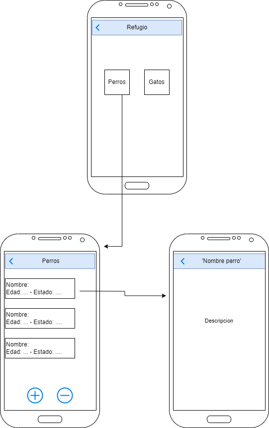

# App Refugio para Animales

*Autor: * Sergio David Acevedo Sanchez

Permite administrar el listado de animales ( peros y gatos) que estan en adopcion en el refugio

Menu: el menu contiene dos botones que son Perros y Gatos, al seleccionar alguno de estos se dirige a una pestana con una lista de los animales para adopcion, se mostrara el nombre del animal, la edad y el estado en que se encuentra, tambien tendra un boton de agregar y eliminar para cuando llegue un nuevo animal al refugio o cuando lo adopten eliminarlo de la lista, al seleccionar el animal saldra su descripcion.