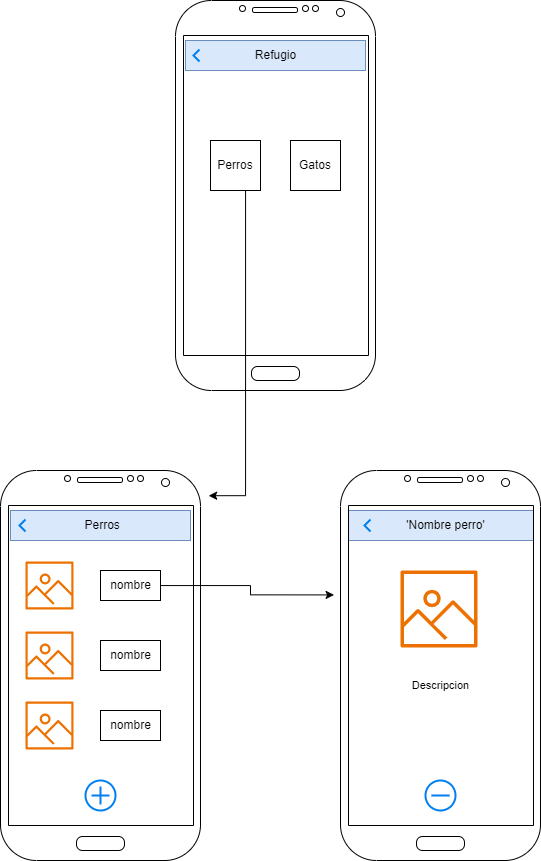

# App Refugio para Animales

*Autor: * Sergio David Acevedo Sanchez

Permite administrar el listado de animales ( peros y gatos) que estan en adopcion en el refugio

Menu: el menu contiene dos botones que son Perros y Gatos, al seleccionar alguno de estos se dirige a una pestana con una lista de los animales para adopcion, tambien tendra un boton de agregar para cuando llegue un nuevo animal al refugio, al seleccionar el animal saldra una imagen con su descripcion y un boton de eliminar, que si en este caso, el animal es adoptado, se elimina de la lista
